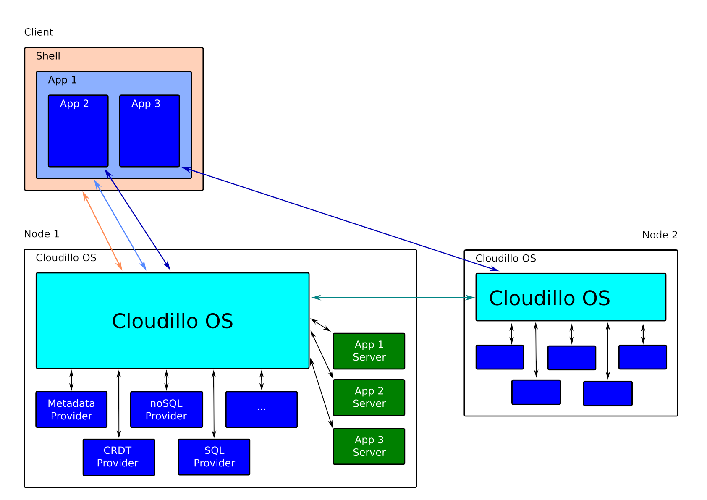

Cloudillo – Collaborating Infrastructure Owned by it's Users
============================================================

Architecture
------------

This page is a work in progress.

### System Components

* Server Components
	* [Cloudillo OS](server/cloudillo-os.md)
	* [Providers](server/providers.md)
		* [Metadata Provider](server/metadata-provider.md)
		* [CRDT Provider](server/CRDT-provider.md)
		* [noSQL Provider](server/noSQL-provider.md)
		* [SQL Provider](server/SQL-provider.md)
* Client Components
	* [Cloudillo Shell](client/cloudillo-shell.md)
	* [Cloudillo Application Library](client/cloudillo-application-library.md)

### Protocols

* Building Blocks
	* Tokens
		* Access Tokens
		* Action Tokens
* Client – Server API
	* [Auth API](server/auth-api.md)
	* [Identity API](server/identity-api.md)
	* [Metadata API](server/metadata-api.md)
	* Storage APIs
		* [Immutable Storage API](server/immutable-storage-api.md)
		* [CRDT API](server/CRDT-api.md)
		* [noSQL API](server/noSQL-api.md)
* Server – Server API
	* [Action API](server/action-api.md)
* Client – Client API
