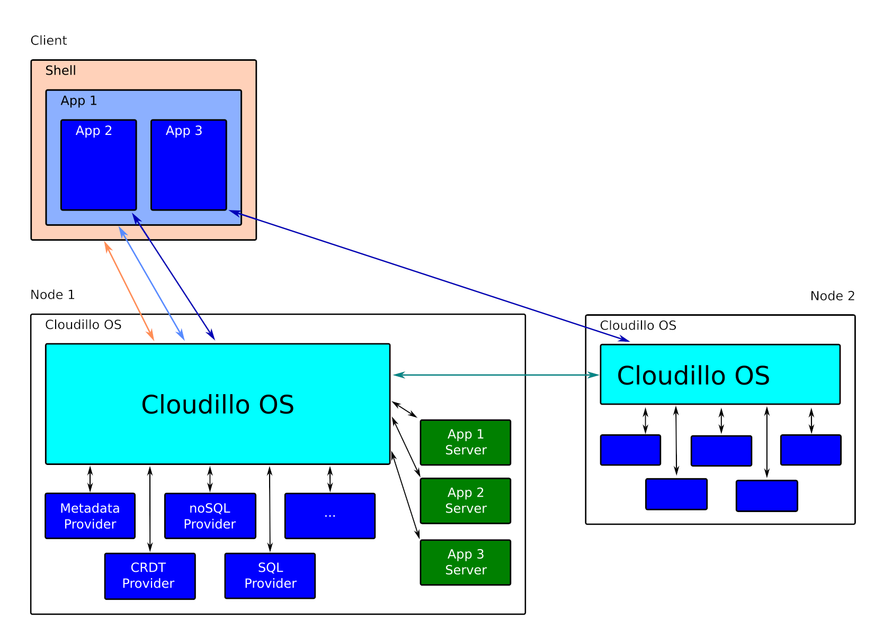

Cloudillo – Collaborating Infrastructure Owned by it's Users
============================================================

Why (the problem)
-----------------

Online collaboration has two main approaches:

* **Cloud based services:** Convenient but concerns about privacy, biases, ads, and censorship.
* **Self-hosted applications:** Flexible but challenging to set up and don't integrate well with each other.

What (the solution)
-------------------

Introducing Cloudillo, the Distributed, Self-Hosted, Open-Source Collaboration Operating System.

Unleash your creativity, collaborate effortlessly, and share without obstacles.

How (the architecture)
----------------------

Cloudillo goes back to the web's roots, offering basic building blocks for
content creation, sharing, and collaboration:

* **Global User Identity, Authentication, Profiles**
* **Generic Storage APIs for:**
  * Collaborative content editing (shared collaborative data types for any document type)
  * Finished content (file store for pictures, PDFs, videos, etc.)
  * Structured data management (databases, collected form data, etc.)
  * User actions (posts, shares, likes, follows, comments)
* **Access Control**
* **Simple, Secure Sharing Model**

Cloudillo is an open platform for building applications, combining the ease of
cloud-based services with the freedom of self-hosted open-source solutions.

It breaks vendor lock-in by separating identity and storage providers,
allowing easy migration between cloud providers or self-hosting.

Which (the services)
--------------------

Applications based on the Cloudillo platform can eventually replace:

* **Collaboration Services:** Google Docs, Office 365, etc.
* **File Sharing Services:** Dropbox, Google Drive, etc.
* **Social Media Services:** Facebook, Twitter, Mastodon, Nostr, etc.
* **Knowledge Management Services:** Notion, Obsidian, etc.
* **Communication Services:** Messenger, Skype, Google Meet, etc.
* ...

Architecture
------------

Roadmap
-------

* Phase 1 – Proof of Concept
	* Cloudillo OS
	* Cloudillo Shell
	* Example Apps
		* Gallerillo – Simple Photo Gallery
		* Quillo – Simple Word Processor
		* Prello – Simple Presentation Builder
		* Formillo – Simple Form Builder
* Phase 2 – API and Protocol Design Finalization
* Phase 3 – MVP Implementation
	* Cloudillo OS
	* Cloudillo Shell
	* Cloudillo Application Library
* Phase 4

Want to be a part of something exciting?
----------------------------------------

We are in the midst of Phase 1, and a functioning PoC Demo is just around the corner.
The upcoming phase is crucial, involving the finalization of architecture, protocols and APIs.
This is where you come in!

We're extending a warm invitation to experienced software architects who are
eager to make a meaningful contribution. Your expertise can shape the future of
our project.

Excited to jump in? Contact me at szilu@symbion.hu.

But hey, we're not just looking for architects – if you're passionate about
what we're building and want to contribute in any way, big or small, we'd love
to hear from you! Don't hesitate to reach out!

System Components
-----------------

* Server Components
	* [Cloudillo OS](server/cloudillo-os.md)
	* [Providers](server/providers.md)
		* [Metadata Provider](server/metadata-provider.md)
		* [CRDT Provider](server/CRDT-provider.md)
		* [noSQL Provider](server/noSQL-provider.md)
		* [SQL Provider](server/SQL-provider.md)
* Client Components
	* [Cloudillo Shell](client/cloudillo-shell.md)
	* [Cloudillo Application Library](client/cloudillo-application-library.md)

Protocols
---------

* Building Blocks
	* Tokens
		* Access Tokens
		* Action Tokens
* Client – Server API
	* [Auth API](server/auth-api.md)
	* [Identity API](server/identity-api.md)
	* [Metadata API](server/metadata-api.md)
	* Storage APIs
		* [Immutable Storage API](server/immutable-storage-api.md)
		* [CRDT API](server/CRDT-api.md)
		* [noSQL API](server/noSQL-api.md)
* Server – Server API
	* [Action API](server/action-api.md)
* Client – Client API
